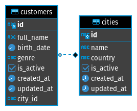

<p align="center">
  

  <a href="https://github.com/mpgxc">
    
  </a>

  

  <a href="https://github.com/mpgxc/short.ly/stargazers">
    
  </a>
</p>

### Arquivo de Rotas /Insomnia

<h1 align="center">
<a href="https://insomnia.rest/run/?label=CompassoAPI&uri=https%3A%2F%2Fgithub.com%2Fmpgxc%2Ffuzzy-umbrella%2Fblob%2Fmain%2Fendpoints.json" target="_blank"></a>
</h1>

### Diagrama de Entidade Relacionamento

<h1 align="center">
    
</h1>

### Funcionalidades

- [x] Cadastrar cliente
- [x] Consultar cliente pelo nome
- [x] Consultar cliente pelo Id
- [x] Remover cliente
- [x] Alterar o nome do cliente

- [x] Cadastrar cidade
- [x] Consultar cidade pelo nome
- [x] Consultar cidade pelo estado

### Baixando e Instalando Depedências

```sh
 git clone git@github.com:mpgxc/fuzzy-umbrella.git
```

```sh
 cd fuzzy-umbrella
```

```sh
 yarn
```

### Executando Projeto

#### Crie um arquivo .env baseado no .env.example e preencha os campos como o exemplo seguinte:

```bash
POSTGRES_HOST=database #Importante que os host permaneça com este nome, pois ele faz referência ao container do postgres
POSTGRES_USER=compassouol
POSTGRES_PASSWORD=compassouol
POSTGRES_DB=cuol
POSTGRES_PORT=5432
```
#### Adicione essa linha também, ela é responsável por conectar ao banco de dados

```bash
DATABASE_URL="postgresql://${POSTGRES_USER}:${POSTGRES_PASSWORD}@${POSTGRES_HOST}:${POSTGRES_PORT}/${POSTGRES_DB}?schema=public"

```

### Criando container do projeto (Desenvolvimento)

```sh
 docker-compose up -d --build
```

### Observando logs de desenvolvimento

```sh
 docker logs compasso_api -f
```

### Executado os testes

```sh
 yarn test #Alternativa yarn test --coverage
```
